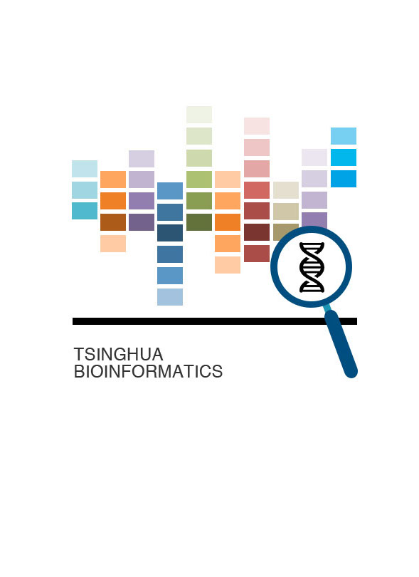

#生物信息学实战
**Bioinformatics in Action**

本书是在清华大学《生物信息学导论》上机指南的基础上编写。

-- 

鲁志

2016年6月于清华园

---
###主要教材和参考书

**主教材**: 

《生物信息学》（第2版）李霞，雷健波，李亦学 等 编 

**习题书**:

《生物信息学实验教程》  吕巍，李滨 编 

**参考书**： 

生物信息：

1. 《Bioinformatics and Functional Genomics》 by Jonathan Pevsner 
2. 《第二代测序信息处理》 [美] 布朗（Brown S.M.）著；于军 主译 

编程相关： 

1. Linux: 《鸟哥的Linux私房菜-基础学习篇》， 主要学习以下2部分
  1. Editor (e.g. VIM)
  2. Shell Script (e.g. bash)
2. Python (or Perl)
  1.  《笨办法学 Python》（《Learn Python The Hard Way》）； 《Python编程入门》
  2.  《Beginning Perl for Bioinformatics》
3. R (or MATLAB):
  1.  Quick R (online)
  2.  《R语言实战》 (《R in action》); 

---
###如何参与

任何问题都欢迎直接联系我们: 

* http://bioinfo.life.tsinghua.edu.cn 
* http://www.ncrnalab.org

---
###许可证

本作品采用 Apache License 2.0 国际许可协议 进行许可. 传播此文档时请注意遵循以上许可协议. 关于本许可证的更多详情可参考 http://www.apache.org/licenses/LICENSE-2.0

---
###贡献者列表

|成员	|联系方式	|Github|
|-|-|-|
|ZJ Lu|http://bioinfo.life.tsinghua.edu.cn| http://github.com/lulab |